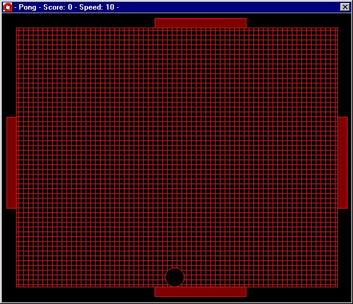



## A game of pong

### Description

I made this code for a friend to help him learn VB. Its a badic game of pong with 4 paddles with score and speed control. This teaches every basic command you will need to learn.
 
### More Info
 

             |
---                |---
**Submitted On**   |2001-02-05 23:43:32
**By**             |[Damenta](https://github.com/Planet-Source-Code/PSCIndex/blob/master/ByAuthor/damenta.md)
**Level**          |Beginner
**User Rating**    |3.5 (14 globes from 4 users)
**Compatibility**  |VB 6\.0
**Category**       |[Games](https://github.com/Planet-Source-Code/PSCIndex/blob/master/ByCategory/games__1-38.md)
**World**          |[Visual Basic](https://github.com/Planet-Source-Code/PSCIndex/blob/master/ByWorld/visual-basic.md)
**Archive File**   |[CODE\_UPLOAD14579262001\.zip](https://github.com/Planet-Source-Code/damenta-a-game-of-pong__1-15051/archive/master.zip)

